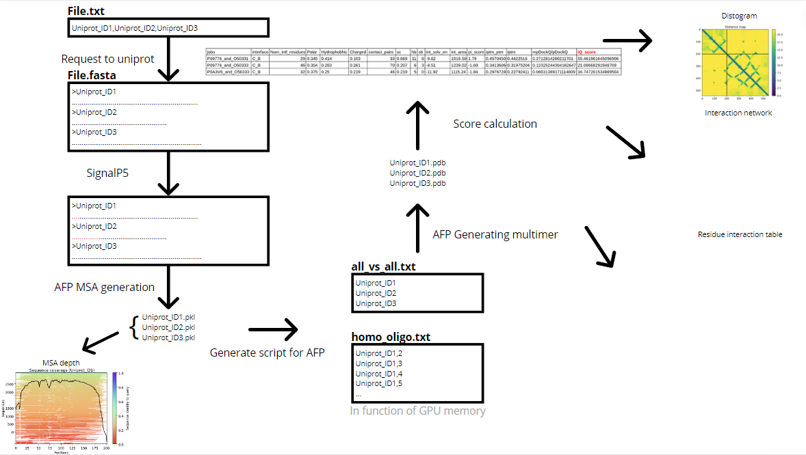

# PPIFold
Automatised pipeline for massive PPI prediction and figure creation.

This python package is use to generate PPI prediction on lot of system, without lost time in generate initial file and sort result.
It predict the better homo-oligomer for protein and better interface to interact with specific proteins. 
This allow to predict massive multimer complexe with lot of PPI.

### Requirements

- Python >3.10
- AlphaPulldown 1.0.4 https://github.com/KosinskiLab/AlphaPulldown with singularity image (v0.4)
- SignalP5 https://services.healthtech.dtu.dk/services/SignalP-5.0/9-Downloads.php

### Installation

You need to install AlphaPulldown 1.0.4 with his database, SignalpP5 and python 3.10.

### Pipeline
 

### Initial File

The initial file need to be Uniprot ID, separate by a comma and in a ".txt" file.

Ex : UniprotID1,UniprotID2,UniprotID3...

### Arguments

Mandatory

 --txt_name Name of the file who contains all Uniprot ID  
 --data_dir Path to the directory with all alphafold database  
 --dir_alpha_analysis Path to singularity image  

Optional

--make_multimers This argument is True by default, if you just want make feature you have to set it on False  
--env_feature The name of the conda environment need to make feature with AlphaPulldown, set by default on None  
--env_multimer The name of the conda environment need to make multimer with AlphaPulldown, set by default on None  
--max_aa The maximum lenght of a model generable by your GPU (in function of Vram), set by default on 2400 (24 Go)  
--use_signalP Use SignalP if your protéins can be periplasmic, set by default on True  

### Result

This pipeline have a cutoff on PAE (10), iQ-score (25) and hiQ-score (50). An alert is set for proteins with MSA depth lower than 100 sequences. 
/!\Result for proteins with less than 100 sequences in MSA is not accurate for validate or invalidate predict PPI. 

*MSA depth 
*Residue interaction table 
*Distogram 
*Interaction network 
